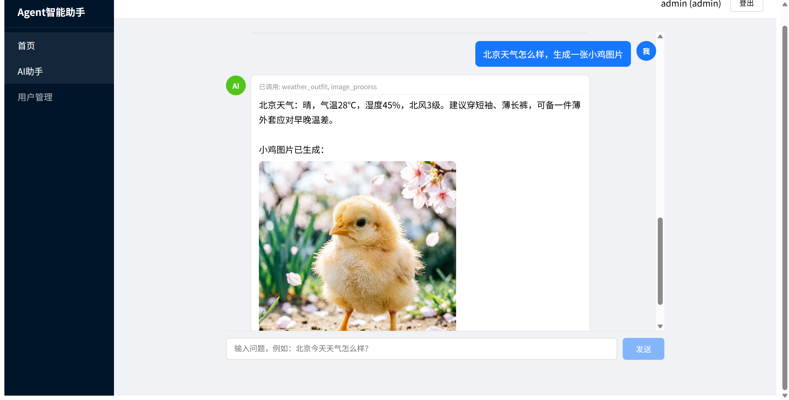

# 项目结构说明

## 概述

基于 **FastAPI + Vue3** 的 AI 智能助手系统，包含用户认证管理和 3 个子 Agent（天气出行、图片处理、工单查询），底层接入千问大模型。

---

## 顶层目录

```
LangChain_01/
├── backend/          # FastAPI 后端
├── frontend/         # Vue3 + TypeScript 前端
├── spec/             # 设计文档
└── PROJECT_STRUCTURE.md   # 本文件
```

---

## 后端 `backend/`

### 入口与配置

| 文件 | 说明 |
|------|------|
| `app/main.py` | FastAPI 入口，注册路由、CORS 中间件 |
| `app/config.py` | 全局配置（MySQL、Redis、JWT、千问 API Key） |
| `app/database.py` | SQLAlchemy 引擎、Session、Base |
| `requirements.txt` | Python 依赖 |
| `init_db.py` | 初始化数据库表 + 默认 admin 账号 |

### agent/ — AI Agent 模块

```
agent/
├── __init__.py
├── intent.py              # 意图识别：千问 qwen-plus 分析用户输入 → 返回需调用的子Agent列表
├── dispatcher.py          # Agent调度器：并行执行多个子Agent，10s超时保护
├── llm_client.py          # 大模型客户端：流式/非流式，System Prompt 控制输出风格
├── mock/                  # 模拟数据
│   ├── weather_data.py    #   模拟城市天气
│   └── work_order_data.py #   模拟工单
└── tools/                 # 子Agent工具
    ├── base.py            #   工具抽象基类 (name/description/execute)
    ├── weather_outfit.py  #   子Agent1: WeatherTool + OutfitTool
    ├── image_process.py   #   子Agent2: ImageToTextTool (qwen3.5-omni-plus) + TextToImageTool (qwen-image-2.0)
    └── work_order.py      #   子Agent3: WorkOrderQueryTool 查询 + 统计
```

### api/ — API 路由

| 文件 | 端点 | 说明 |
|------|------|------|
| `api/auth.py` | `POST /api/auth/login\|refresh\|logout` `GET /api/auth/me` | JWT 登录认证 |
| `api/users.py` | `POST/GET /api/users` `GET /api/users/{id}` | 用户 CRUD（admin only） |
| `api/agent.py` | `POST /api/agent/chat` | Agent 对话入口（SSE 流式） |

### core/ — 公共模块

| 文件 | 说明 |
|------|------|
| `core/security.py` | bcrypt 密码哈希、JWT 生成/解码 |
| `core/deps.py` | FastAPI 依赖注入：`get_current_user`、`require_admin` |
| `core/redis_client.py` | Redis 操作：refresh token 存取 |

### models/ & schemas/

| 文件 | 说明 |
|------|------|
| `models/user.py` | User ORM 模型（SQLAlchemy） |
| `schemas/auth.py` | 登录/刷新 请求响应 Pydantic |
| `schemas/user.py` | 用户创建/列表 请求响应 Pydantic |

---

## 前端 `frontend/`

### 入口与配置

| 文件 | 说明 |
|------|------|
| `index.html` | HTML 入口 |
| `src/main.ts` | Vue3 挂载，注册 Pinia + Router |
| `src/App.vue` | 根组件，`<router-view />` |
| `src/style.css` | 全局样式 |
| `vite.config.ts` | Vite 构建配置 |
| `package.json` | 依赖（Vue3、Pinia、Vue Router、Axios） |

### src/router/ — 路由

`router/index.ts`

| 路径 | 页面 | 权限 |
|------|------|------|
| `/login` | Login.vue | 未登录 |
| `/` | Home.vue | 已登录 |
| `/agent` | AgentChat.vue | 已登录 |
| `/users` | UserList.vue | admin |
| `/users/create` | UserCreate.vue | admin |
| `/users/:id` | UserDetail.vue | admin |

导航守卫：未登录→`/login`，非admin→`/users/*` 重定向首页。

### src/api/ — API 封装

| 文件 | 说明 |
|------|------|
| `api/auth.ts` | 登录/刷新/登出/me |
| `api/users.ts` | 用户 CRUD |
| `api/agent.ts` | SSE 流式对话，fetch + ReadableStream，`await` 逐消息渲染 |

### src/stores/ — 状态管理

`stores/auth.ts` — Pinia Auth Store：`user`、`isAdmin`、`isLoggedIn`、`login()`、`fetchUser()`、`logout()`，token存 localStorage。

### src/utils/ — 工具

`utils/request.ts` — Axios 实例（baseURL: `8002`），自动注入 Bearer token，401 时队列化刷新 token。

### src/components/ — 组件

| 文件 | 说明 |
|------|------|
| `AppLayout.vue` | 侧边栏 + 顶栏 + `<router-view>` 布局 |
| `Sidebar.vue` | 侧边栏：首页 / AI助手 / 用户管理(admin) |

### src/views/ — 页面

| 文件 | 说明 |
|------|------|
| `Login.vue` | 登录表单，错误提示 |
| `Home.vue` | 欢迎页，显示用户名和角色 |
| `agent/AgentChat.vue` | AI 对话页：聊天气泡、流式渲染（requestAnimationFrame节流）、图片点击放大 |
| `users/UserList.vue` | 用户列表：表格、搜索、分页 |
| `users/UserCreate.vue` | 创建用户表单 |
| `users/UserDetail.vue` | 用户详情 |

---

## 核心数据流

```
用户输入 → POST /api/agent/chat
  ├─ intent.py     千问 qwen-plus 意图识别 → {tools, params}
  ├─ dispatcher.py 并行调度子Agent → 合并工具结果
  └─ llm_client.py 千问 qwen-plus 流式总结 → SSE 推送到前端
       └─ 前端 requestAnimationFrame 逐帧渲染 → 逐字流式显示
```

## 技术栈

| 层 | 技术 |
|----|------|
| 后端框架 | FastAPI |
| 数据库 | MySQL + SQLAlchemy |
| 缓存 | Redis（refresh token） |
| 认证 | JWT 双 token（access 30min + refresh 7d）+ bcrypt |
| AI | LangChain + 千问大模型（qwen-plus / qwen-image-2.0） |
| 前端 | Vue3 + TypeScript + Vite |
| 状态 | Pinia |
| HTTP | Axios（REST）+ fetch（SSE 流式） |


## 注意
app/config_2.py 改为config.py 增加对应数据库等的信息

## 效果图


